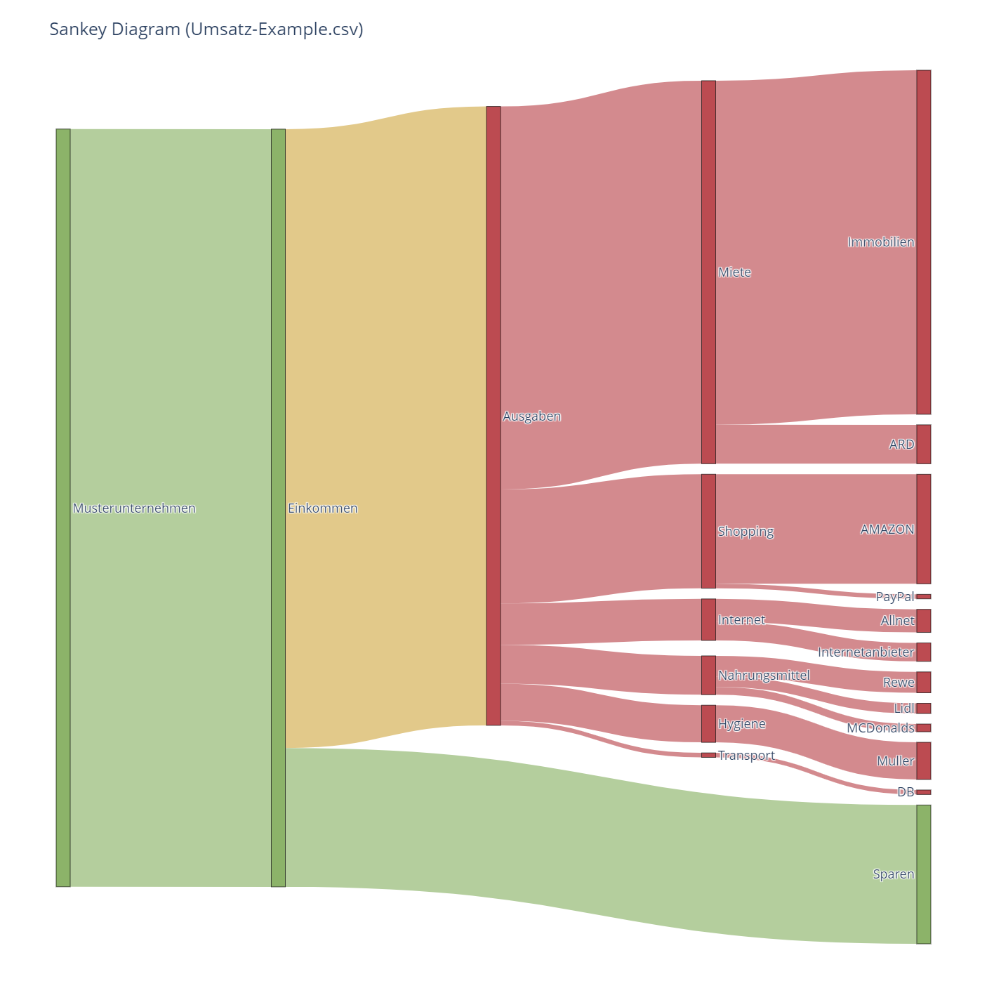

# Ein Programm, das ein Sankey-Diagramm erstellt

- **Input**: a csv-export of incomes and expenses
  ```csv
    Buchungstag;Valuta;Textschluessel;Primanota;Zahlungsempfaenger;Waehrung;Umsatz;Soll/Haben
    02.03.2022;02.03.2022;Basislastschrift;985;Mustermann Immobilien;EUR;485,00;S
    02.03.2022;02.03.2022;Basislastschrift;985;Muster Internetanbieter;EUR;26,00;S
    02.03.2022;02.03.2022;Basislastschrift;985;Smart Allnet Flat;EUR;32,50;S
    02.03.2022;02.03.2022;Basislastschrift;985;ARD ZDF;EUR;54,86;S
    02.03.2022;02.03.2022;Basislastschrift;985;AMAZON PAYMENTS EUROPE;EUR;65,21;S
    02.03.2022;02.03.2022;Basislastschrift;985;PayPal (Europe);EUR;6,30;S
    03.03.2022;03.03.2022;Kartenzahlung girocard;985;LIDL DIENSTLEISTUNG GMBH UND CO KG;EUR;14,38;S
    03.03.2022;03.03.2022;Lohn/Gehalt;985;Musterunternehmen;EUR;1068,13;H
    03.03.2022;03.03.2022;Basislastschrift;985;AMAZON PAYMENTS EUROPE;EUR;89,21;S
    05.03.2022;05.03.2022;Kartenzahlung girocard;985;REWE Markt GmbH;EUR;29,40;S
    05.03.2022;05.03.2022;Kartenzahlung girocard;985;Muller Drogeriemarkt;EUR;52,39;S
    07.03.2022;07.03.2022;Kartenzahlung girocard;985;DB Ticketautomat;EUR;6,32;S
    07.03.2022;07.03.2022;Kartenzahlung girocard;985;MCDonalds Fastfood;EUR;10,89;S
  ```
- **Output**: a html-file with a Sankey-Diagramm
  

## Installation and steps to use

1. Download source code
2. Install dependencies (`pip install -r requirements.txt`)
3. Edit configuration (see [config.py](config.py))
4. Run `python app.py`
5. Open html-file in browser
6. Save your plot as a png-file
